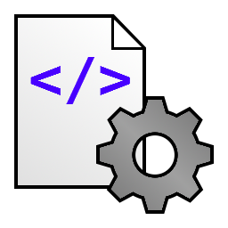

# TinySSG

*Read in: [Russian](README-RU.md)*

**TinySSG** is a minimalistic static site generator written in Python 3. It is developed to be simple and easy to use, especially for users who do not wish to spend their time (and nerves) on learning and messing with more complex generators.

It has been written by me for my personal needs and for learning the basic principles of static site generator working. However, I will be happy if someone finds my work interesting and useful.

## Installation

TinySSG requires Python 3.9 or newer and [Python-Markdown](https://pypi.org/project/Markdown/) module (can be installed by `pip install markdown` command).

After installing dependencies download [the latest release](https://github.com/ivan-movchan/tinyssg/releases/latest) or clone this repository using Git.

## Usage

The configuration of TinySSG is done by editing `config.py` module, which has a minimal configuration and therefore should not be hard to edit. After configuring TinySSG, run `tinyssg.py` module.

The first line in every source file must contain the page title. Starting from the third line, the page content begins. If `markdown` module is successfully loaded, TinySSG will transform the content from Markdown to HTML. Otherwise, it will be inserted to the webpage as is, without any modifications.

In `demo` folder you will find an example of a static site that can be generated using TinySSG. 

## Known problems (and their solutions)

- TinySSG is not able to replace hyperlinks related to source files (`some_page.md`) with hyperlinks related to HTML pages (`some_page.html`).
  The solution is to edit all these hyperlinks manually.
- TinySSG is not able to scan source directories recursively. You need to specify source/target directories manually.
  *(This can be used as a feature: you may generate static sites without having to place all source files in one directory.)*

## Contributing

Do not hesitate to report occurred problems and suggest new ideas. Using ["Issues"](https://github.com/ivan-movchan/tinyssg/issues) page is recommended. When reporting problems, make sure you are using the latest version of TinySSG and its dependencies. Do not forget to report used Python version and operating system.

You are free to fork this repository and improve the project. It is adviced that you follow project coding style when working with the source code. When you are ready, send a pull request and describe the work you have done.

Thank you for your interest in TinySSG.

## License

TinySSG is free software and is licensed under the [MIT License](LICENSE).